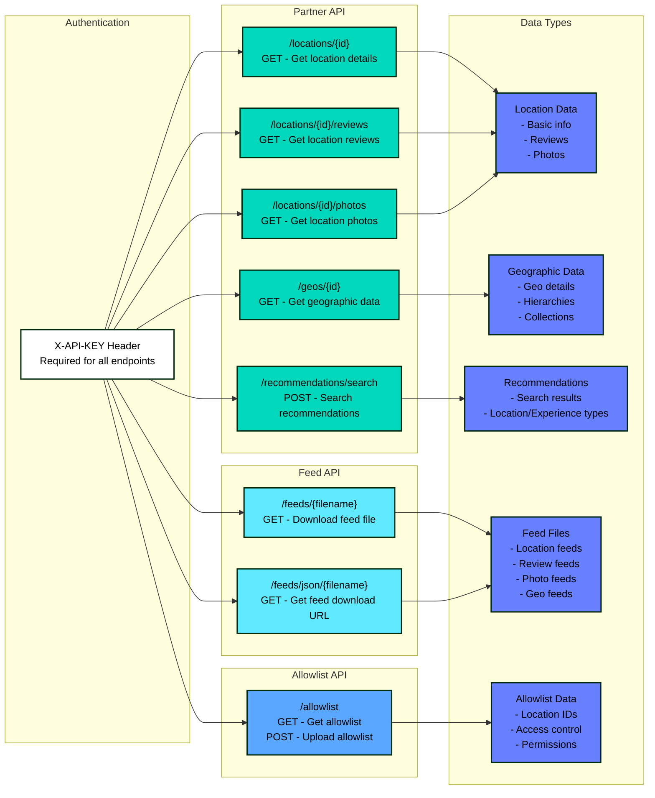

# Endpoints Overview

 

```mermaid
graph LR
    subgraph "Partner API"
        PA1["/recommendations/search<br/>POST - Search recommendations"]
        PA2["/locations/{id}<br/>GET - Get location details"]
        PA3["/locations/{id}/reviews<br/>GET - Get location reviews"]
        PA4["/locations/{id}/photos<br/>GET - Get location photos"]
        PA5["/geos/{id}<br/>GET - Get geographic data"]
    end
    
    subgraph "Feed API"
        FA1["/feeds/{filename}<br/>GET - Download feed file"]
        FA2["/feeds/json/{filename}<br/>GET - Get feed download URL"]
    end
    
    subgraph "Allowlist API"
        AL1["/allowlist<br/>GET - Get allowlist<br/>POST - Upload allowlist"]
    end
    
    subgraph "Authentication"
        AUTH["X-API-KEY Header<br/>Required for all endpoints"]
    end
    
    subgraph "Data Types"
        DT1["Location Data<br/>- Basic info<br/>- Reviews<br/>- Photos"]
        DT2["Geographic Data<br/>- Geo details<br/>- Hierarchies<br/>- Collections"]
        DT3["Recommendations<br/>- Search results<br/>- Location/Experience types"]
        DT4["Feed Files<br/>- Location feeds<br/>- Review feeds<br/>- Photo feeds<br/>- Geo feeds"]
        DT5["Allowlist Data<br/>- Location IDs<br/>- Access control<br/>- Permissions"]
    end
    
    %% Connections
    AUTH --> PA1
    AUTH --> PA2
    AUTH --> PA3
    AUTH --> PA4
    AUTH --> PA5
    AUTH --> FA1
    AUTH --> FA2
    AUTH --> AL1
    
    %% Data flow connections
    PA1 --> DT3
    PA2 --> DT1
    PA3 --> DT1
    PA4 --> DT1
    PA5 --> DT2
    FA1 --> DT4
    FA2 --> DT4
    AL1 --> DT5
    
    %% Styling with black font color
    classDef partnerApi fill:#00D7BB,stroke:#002B11,stroke-width:2px,color:#000000
    classDef feedApi fill:#5FEAFF,stroke:#002B11,stroke-width:2px,color:#000000
    classDef allowlistApi fill:#59A7FF,stroke:#002B11,stroke-width:2px,color:#000000
    classDef auth fill:#FFFFFF,stroke:#002B11,stroke-width:2px,color:#000000
    classDef dataType fill:#6780FF,stroke:#002B11,stroke-width:2px,color:#000000
    
    class PA1,PA2,PA3,PA4,PA5 partnerApi
    class FA1,FA2 feedApi
    class AL1 allowlistApi
    class AUTH auth
    class DT1,DT2,DT3,DT4,DT5 dataType
```